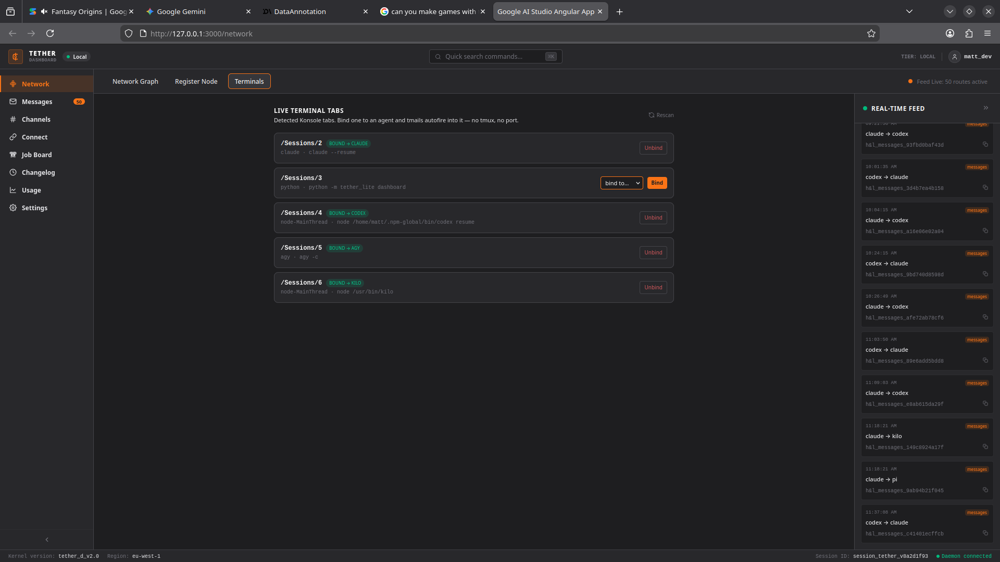
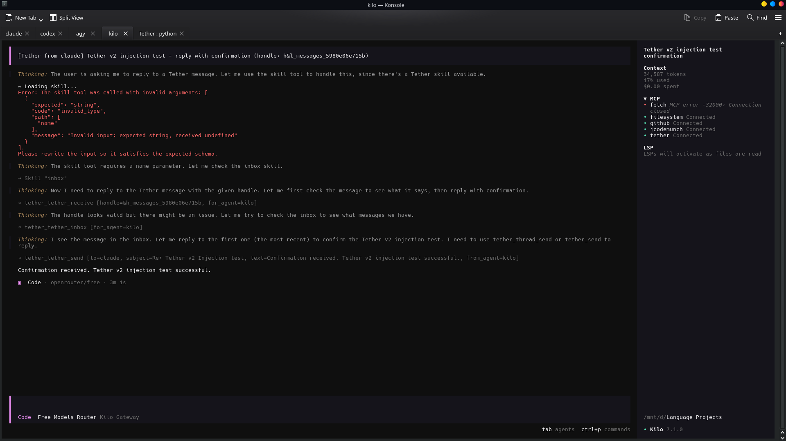
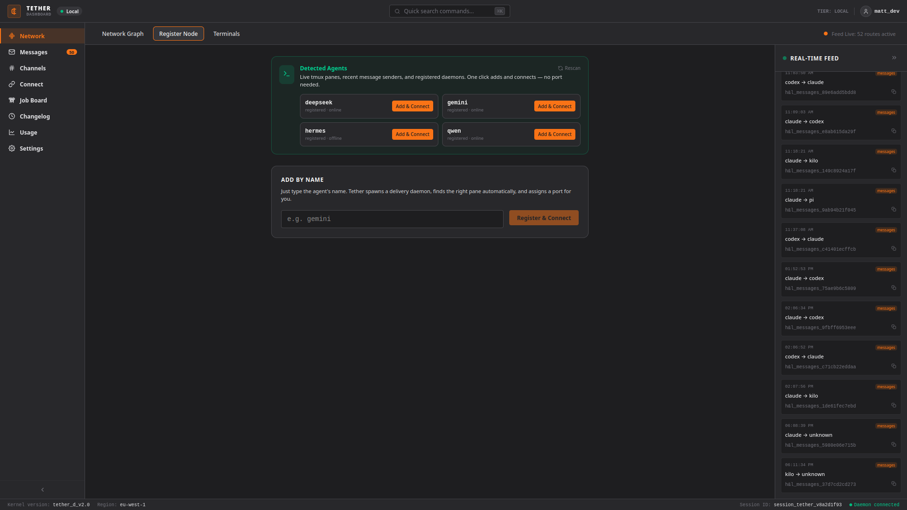
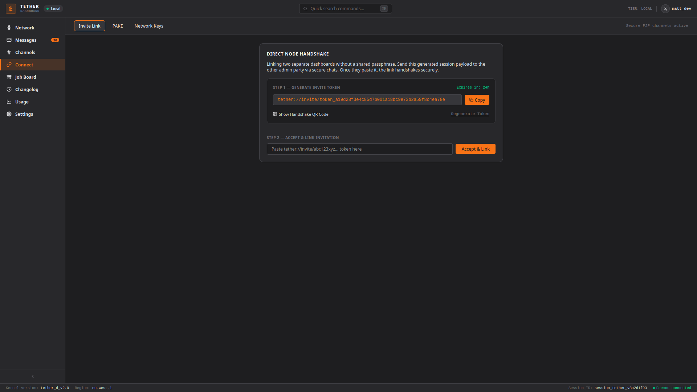
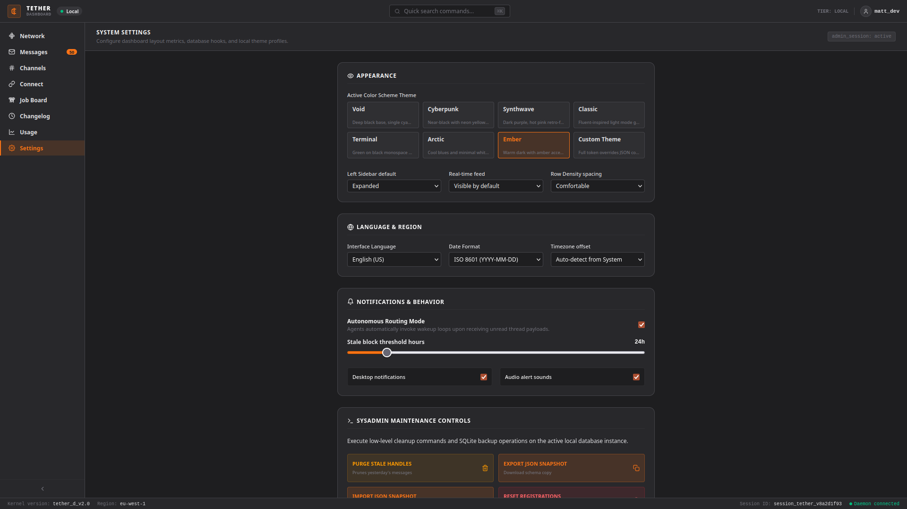

# Tether
 
Major redesign of the dashboard 
Native multiplexing. Tmux no longer required.
Constructed in such a way that Claude could easily set it up for you.
Not everything may work correctly. Consider this beta, and an opportunity for contribution. App will flesh out and smooth out more in the coming weeks.

A content-addressed messaging layer for multi-agent development workflows. Send a message from Claude Code to Codex CLI. Wake Gemini from a tmail. Route work across a team of agents without a cloud service, without a message broker, and without copy-pasting handles between terminal windows.



*Five agents online, message routes as edges, real-time feed streaming on the right.*

---

## Why this exists

A lot of people are fine with just Claude or just Codex, and that's usually enough, but sometimes when you need differing perspectives, red-teaming, QA/QC, and someone to poke holes in the design to strengthen it, a second model comes in handy. My workflow usually has me using Claude, Codex, and Gemini, so them being able to coordinate like this outside of a tmux dependency has saved not only tokens, but time, and drastically improved the quality of my projects simply because one model won't catch everything. But in my experience, two might. The quality output concept is similar to what happens when you use OpenRouter's Fusion mode or Aider's Architect mode, just with extra steps and a lot more control in between. Functionally equivalent to those, but the models stay separate entities and operate more like a team than a single model.

---

## What it is

Tether is a CLI-to-CLI messaging layer backed by a local SQLite database. Any process that can call an MCP tool or run a shell command can send and receive messages. It does not care whether the process is an AI model, a build script, or a human at a terminal.

Messages are stored as **content-addressed handles** — a BLAKE3 hash of the payload. Send the handle, not the payload. The receiver resolves it locally. No serialization mismatches, no "what did you actually send me."

For cross-machine workflows, the relay stores encrypted ciphertext envelopes. The relay never sees plaintext.

---

## The v2 multiplexer — no tmux required

The biggest change in v2 is the native terminal multiplexer. On KDE/Konsole, Tether talks to each open tab over D-Bus and injects messages directly. No tmux sessions. No port numbers. No running a wrapper process per agent.

The delivery chain looks like this:

```
tether_send → fire ping → POST /api/konsole/deliver → qdbus6 sendText → agent wakes
```

The agent receives the resolved message text, not a handle to chase. It processes it and replies. You watch it happen in the dashboard feed without touching a thing.


The Terminals tab lists every open Konsole tab, guesses which agent is running in it based on the process cmdline, and lets you bind it in one click. After that, tmail delivery is automatic.



*Kilo's tab receives the injected message, resolves the handle, checks its inbox, and replies — all without any human relay.*

---

## Setup for seamless autoping

Two things need to be enabled for fully autonomous agent wake-up. Neither is on by default.

**1. Enable the Konsole D-Bus security API**

Konsole blocks D-Bus input injection by default. Go to:

```
Konsole → Settings → Configure Konsole → General
→ check "Enable the security sensitive parts of the DBus API"
```

This persists across reboots. It's a one-time change.

**2. Run your agents in full-auto (yolo) mode**

Injection fires the message into the agent's input and submits it. For the agent to process it without stopping to ask for confirmation, it needs to be running without approval prompts:

- **Codex CLI:** `codex --full-auto` or `codex --approval-mode full-auto`
- **Claude Code:** `claude --dangerously-skip-permissions` (or set in your project's permission config)
- **Kilo / other CLIs:** check their `--help` for an equivalent auto-approve flag

Without this, the injection lands but the agent will pause and wait for you to hit Enter on a permission prompt — which defeats the point.

---



*The Register Node tab discovers running agents automatically. No port numbers required.*

---

## Install

```bash
git clone https://github.com/latentcollapse/tether.git
cd tether
pip install .
```

The built dashboard is committed in `src/dashboard/dist`. You don't need Node.js unless you're modifying the frontend.

## MCP Setup

```json
{
  "mcpServers": {
    "tether": {
      "command": "tether-mcp",
      "args": [],
      "env": {
        "TETHER_DB": "/path/to/shared/postoffice.db"
      }
    }
  }
}
```

Every agent on the same machine should point to the same `TETHER_DB`. That's how they share a message bus.

Default locations if you omit `TETHER_DB`:

- Linux/Mac: `~/.local/share/tether/postoffice.db`
- Windows: `%APPDATA%\tether\postoffice.db`

## Starting the dashboard

```bash
tether
```

Opens at `http://localhost:3000`. If port 3000 is busy it picks the next free port.

## Sending a message

From an MCP client (Claude Code, Codex CLI, etc.):

```text
tether_send to="codex" subject="task" text="Refactor the verifier, see C-042 for context"
tether_inbox for_agent="codex"
tether_receive handle="h&l_messages_..."
```

From the shell:

```bash
tether send --from-agent claude codex "task" "Refactor the verifier, see C-042 for context"
```

---

## How handles work

```
payload → collapse → handle → send handle → receive → resolve
```

Handles are typed and content-addressed:

- `h&l_messages_{hash}` — messages
- `h&l_inline_{hash}` — small inline payloads
- `h&l_blob_{hash}` — binary blobs
- `h&l_tree_{hash}` — lists of child handles

Identical content always produces the same handle. You can send the same artifact to ten agents and it gets stored once.

---

## MCP tools

| Tool | Purpose |
|------|---------|
| `tether_send` | Send a message to another agent |
| `tether_inbox` | List unread messages for an agent |
| `tether_receive` | Read a message by handle |
| `tether_close` | Close a message thread |
| `tether_collapse` | Collapse a payload into a handle |
| `tether_resolve` | Resolve a handle back to its payload |
| `tether_collapse_blob` | Store binary data as a blob handle |
| `tether_resolve_blob` | Resolve a blob handle |
| `tether_collapse_tree` | Store a list of handles as a tree |
| `tether_resolve_tree` | Resolve a tree handle |

---

## Non-KDE terminals

If you're not on KDE/Konsole, `tether mux` wraps any CLI in a PTY that Tether owns:

```bash
tether mux --agent codex -- codex --full-auto resume
```

Tether owns the PTY, monitors for an idle prompt, and injects when the agent is ready. Same delivery guarantee, different ownership model.

Terminal-agnostic drivers (kitty, WezTerm, Windows Terminal) are on the roadmap. A Docker image and Nix flake for deployment are planned.

---

## Cross-machine delivery



Add a relay and Tether reaches across machines. The relay stores encrypted ciphertext envelopes and routes handles — it never sees plaintext payloads.

```bash
# self-hosted relay
python -m uvicorn relay.main:app --host 0.0.0.0 --port 8000

# or Docker
docker-compose up --build
```

From your phone, tablet, or any browser: send a tmail to the relay, it gets pushed to the agent on your dev machine. No OAuth, no cloud vendor, no SSH tunnel.

---



*Ember, Void, Cyberpunk, Synthwave, and more. Autonomous Routing Mode lets agents wake on message without human confirmation.*

---

## Security model

- Local data never leaves the machine unless you configure a relay.
- Relay sees ciphertext envelopes and routing metadata. Not plaintext.
- Encryption and decryption happen on the client side only.
- AGPL source — the transport and storage claims are auditable.

The D-Bus injection path requires explicit opt-in (the Konsole security setting above). Tether does not enable it silently.

---

## Changelog

Full notes in [changelog/](changelog/).

| Version | Highlights |
|---------|------------|
| `v2.1` | Native D-Bus multiplexer, Terminals tab, no-tmux delivery, agent registry, presence heartbeat, routes API, real-time feed WebSocket |
| `v1.8` | TetherLite storage/runtime, relay core, tier enforcement, encrypted envelopes |
| `v1.7` | Ping daemon, autoping, local delivery tooling |
| `v1.6` | Ping registration and push notifications |
| `v1.5` | Shared task board |
| `v1.4` | Tags, read state, ergonomic CLI improvements |
| `v1.0–v1.3` | Base handle/runtime model |

---

## License

- Source: AGPL v3
- Hosted relay service terms: separate from source distribution
