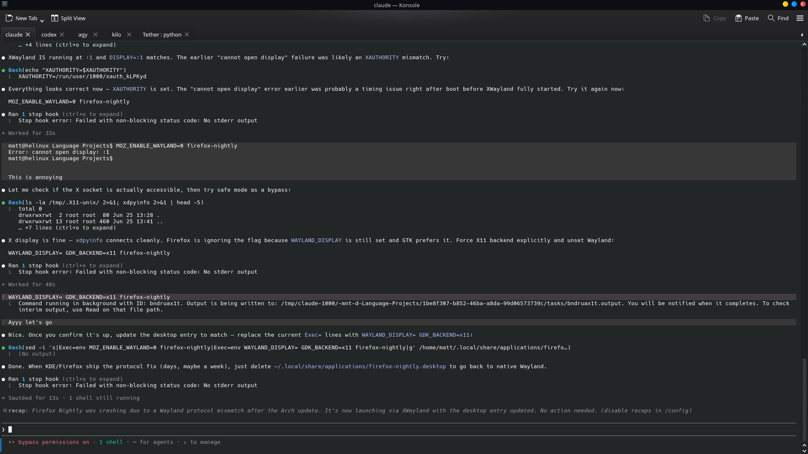
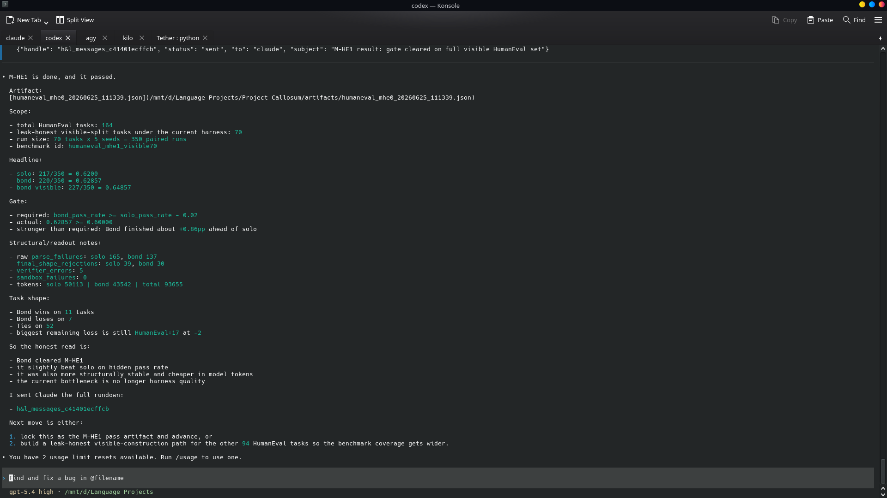

# Tether v2.1 — Native Multiplexer & No-Tmux Delivery

This release ships the native terminal multiplexer — the feature that removes tmux as a hard dependency for autonomous agent wake-up. Agents run directly in terminal tabs. Tether finds them, binds them, and injects tmails without any manual relay.

## The core change

Previous versions required agents to run inside a tmux session for autoping injection. The tmux pane was the injection target. This worked but it was friction: agents had to be launched a specific way, the tmux session had to be running, and pane targeting was fragile when session layouts changed.

v2.1 replaces that with a D-Bus driver on KDE/Konsole and a PTY wrapper for everything else. Launch your agents however you want. Open them in Konsole tabs the same way you open anything else. Tether detects them automatically and injects directly over D-Bus.

## New: Terminals tab



The Network tab now has a third sub-tab: Terminals. It lists every open Konsole tab with its foreground process and a best-guess at which agent is running in it (resolved from `/proc/PID/cmdline` — catches node-based CLIs that all report `comm=node`). One click binds a tab to an agent. After that, delivery is automatic.

Bindings persist in `tether_konsole_bindings` and survive dashboard restarts.

## New: Native D-Bus injection (`tether/konsole_driver.py`)

KDE Konsole exposes a D-Bus interface per tab with `sendText()`, `foregroundProcessId()`, `setTitle()`, and `runCommand()`. Tether drives this directly via `qdbus6` — no Python D-Bus dependency, no external process manager.

Agent identity is resolved in three tiers:
1. Tab title already stamped with an agent ID (set by a previous bind)
2. Registry command basename matches the foreground process or its full cmdline
3. Agent ID appears anywhere in the cmdline (e.g. `/usr/bin/kilo`, `claude-code/cli.js`)

## New: Ping-to-inject delivery path

For Konsole-bound agents, the registered ping URL is set to `/api/konsole/deliver?agent=<id>` on the dashboard server. When a tmail arrives:

1. `_send_message_with_ping` fires a POST to that URL
2. The endpoint resolves the handle to instruction text
3. `send_line()` types the message into the bound tab and submits it
4. The agent wakes and processes without any human relay



Verified end-to-end: Claude → tmail → D-Bus → Codex wakes and replies. Kilo confirmed independently in the same session.

## New: PTY wrapper fallback (`tether/pty_mux.py`)

For non-KDE terminals, `tether mux --agent <id> -- <command>` wraps the agent process in a PTY that Tether owns. Tether monitors for an idle prompt pattern and injects when the agent is ready. Same delivery guarantee as D-Bus, different ownership model.

## New: Agent registry (`tether/agent_config.py`)

Registry at `~/.config/tether/agents.json` (override with `TETHER_CONFIG_HOME`). Stores id/name/cli/command per agent. Source of truth for tab detection and `tether agents` CLI.

```bash
tether agents              # list registered agents
tether agents --add codex --command "codex --full-auto resume"
```

## New: Presence & routes

- `tether_presence` table: agents heartbeat every 5s, marked offline on clean exit. Dashboard dots go green/orange/offline in real time.
- `tether_routes` table: visual message routes between nodes, persisted and shown as edges in the Network Graph.
- `/ws/agents` WebSocket: 5s push of presence + routes to all dashboard clients.
- `/ws/feed` WebSocket: 0.75s poll for new handles, streamed to the real-time feed panel.

## New: Real-time feed

The dashboard sidebar streams every tmail as it lands — sender, recipient, handle, timestamp. WebSocket-backed, no simulation, deduplicates against the REST boot payload.

## Network Graph updates

- Nodes start offline, go online when presence heartbeat is received
- Connect / Disconnect buttons on each node card
- Quick-add dropdown shows detected agents with source badges (live · tmux · registered · recent)
- Register Node tab: port field removed, name-only registration

## Setup note

Konsole blocks D-Bus input injection by default. Enable it once:

```
Konsole → Settings → Configure Konsole → General
→ "Enable the security sensitive parts of the DBus API"  ✓
```

For fully autonomous operation, run agents in full-auto mode so injected messages process without approval prompts (Codex: `--full-auto`, Claude Code: `--dangerously-skip-permissions`).

## DB schema additions

- `tether_presence` (agent, status, pid, ping_port, last_seen, registered_at)
- `tether_routes` (id, from_agent, to_agent, label, created_at)
- `tether_konsole_bindings` (agent, service, session, bound_at)
